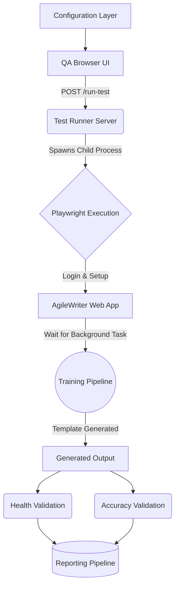

Document Status: Canonical
Related Legacy Docs: TBD

# Architecture

## First Mental Model
If you are new:

Run this path mentally:
Configuration → UI → Server → Playwright → Training → Generated Output → (Health / Accuracy) → Reporting

Then come back and read details.

## What This Component Does NOT Do
* **Server does NOT execute test logic:** It only spawns the Playwright process.
* **Playwright does NOT score accuracy:** It only drives the browser; `accuracy-scorer.ts` handles validation.
* **Reporting does NOT upload results:** Reports are saved locally and must be manually reviewed or shared.

## The Execution Pipeline

## 1. The Configuration Layer
The base layer consists of the `.env` file and `runtime-config.ts`. This layer dictates target environments, template folders, and Microsoft credentials before any process starts.

## 2. The Orchestration Layer (UI & Server)
The execution begins at the QA Browser UI (`http://localhost:3000/ui/`). A user selects a script and clicks execute. This sends an HTTP POST request to the Test Runner Server (`test-runner-server.js`). 

> Decision: SESSION_ID Isolation
> Why this exists: To allow multiple test runs to output files without overwriting each other.
> Consequence: The server generates a unique ID and passes it into the Playwright environment variables.

## 3. The Automation Layer (Playwright)
The Playwright Execution engine launches Chromium and interacts with the AgileWriter web application. It handles authentication and navigates SharePoint integrations to locate templates.

## 4. The Synchronization Layer (Training)
Because AgileWriter relies on asynchronous machine learning models, generation is not instantaneous. The automation suite enters the Training Pipeline synchronization phase (`helpers/training-setup.ts`), monitoring the UI until AI processing completes.

## 5. The Validation Layer (Health vs Accuracy)
Once the document is generated, the path splits based on the test intent:
* **Health Validation:** Verifies the document was created successfully without server errors.
* **Accuracy Validation (Optional):** Passes the generated text to the Accuracy Scorer to mathematically diff against a baseline reference file.

## 6. The Output Layer (Reporting)
Every step is tracked by a telemetry logger. When the run finishes, the Reporting Pipeline (`generate-word-report.js`) compiles the data into a final DOCX report. 

**Current behavior:**
Report generation writes synchronously and relies on deterministic output handling.

## 7. Container Boundaries and Persistence
With the introduction of Docker, the system architecture includes strict container boundaries. The Node.js server runs inside an isolated container (`mcr.microsoft.com/playwright:v1.58.2-noble`) and state is ephemeral by default.

Data must be explicitly mounted out of the container to survive:
* `sessions/` → Mounted to preserve Playwright traces and `step-results.json`. Owned by the Orchestration Layer.
* `reports/` → Mounted to preserve final DOCX files. Owned by the Output Layer.
* `playwright/.auth/` → Mounted to preserve Microsoft SSO login state across test runs.

## Future Considerations
Introduce atomic write (`.tmp` rename) + newest-file selection to definitively eliminate read/write race conditions during report download.

## Failure Isolation
The architecture is designed to preserve forensic data even if a layer crashes.

* **UI Failure:** Can be bypassed by triggering the server API directly.
* **Server Failure:** Stops execution entirely. Check Node console logs.
* **Playwright / App Failure:** If AgileWriter crashes, Playwright fails the test, but the telemetry log still records all successful steps prior to the crash.
* **Training Failure:** If the AI training times out, telemetry is preserved, screenshots remain in the directory, and a partial failure report is still generated.
* **Reporting Failure:** If DOCX generation fails, the raw JSON telemetry (`step-results.json`) survives on disk for manual inspection.
