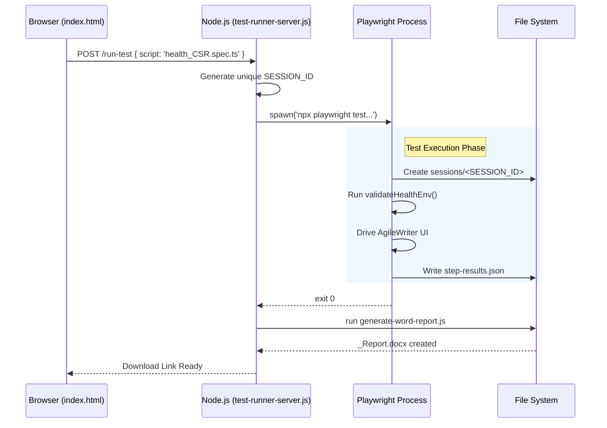

# System Architecture Deep Dive

## 1. Why This Exists

`Architecture.md` covers the 10,000-foot view. This document is the 100-foot view. 

If you need to debug why a test result isn't showing up in the UI, or why the Python pipeline can't find your generated document, you need to understand exactly how data flows between the Node.js server, the Playwright process, and the Python backend.

## 2. Mental Model

The architecture is strictly decoupled. The UI does not know how to run tests. Playwright does not know how to score accuracy. 

Think of it as an assembly line where each station only communicates by dropping files into a shared basket (the `sessions/` directory).

1. **The Server (Node.js)** receives requests and spawns isolated Playwright processes.
2. **Playwright** does the heavy lifting, dumping its logs and telemetry (`step-results.json`) into the basket.
3. **The Report Generator (Node.js)** picks up the basket and turns the raw telemetry into a Word Document.
4. **The Accuracy Pipeline (Python)** picks up the generated document and scores it against an answer key.

## 3. Real Example: The Request Lifecycle

When a user clicks "Run Test" on `localhost:3000/ui`, here is the exact architectural chain reaction:

## 4. Component Deep Dives

### 4.1 Test Runner Server (`server/test-runner-server.js`)

This is an Express application that acts as an execution broker. It has three main jobs:

1. **Session Management**: It assigns a `SESSION_ID` to every run. This ID is passed to Playwright via environment variables (`process.env.SESSION_ID`). This guarantees that concurrent runs do not overwrite each other's files.
2. **Subprocess Orchestration**: It uses Node's `child_process.spawn()` to run Playwright. It listens to `stdout` and `stderr`.
3. **Log Streaming**: It uses Server-Sent Events (SSE) via the `/stream` endpoint to pipe the `stdout` from the child process directly to the user's browser in real-time. Before sending, it scrubs PII (emails, passwords) from the logs.

### 4.2 Playwright Telemetry (`helpers/step-tracker.ts`)

Playwright does not return a JSON object to the server when it finishes. Instead, it writes to disk. 
The `step-tracker.ts` helper maintains an array of steps (e.g., `[ { step: "Login", status: "PASS" } ]`). In the `test.afterAll()` hook, it dumps this array to `sessions/<SESSION_ID>/step-results.json`.

### 4.3 Report Generator (`generate-word-report.js`)

This is a standalone Node script. It expects to find `step-results.json`. It converts the JSON array into an HTML table with colored badges, and uses `html-to-docx` to generate a Word file.

**Crucial Architecture Feature: Atomic Writes**
To prevent the server from trying to serve a half-written DOCX file, the generator writes to a `.tmp` file first. Once the file is 100% written, it uses `fs.renameSync()` to instantly swap it to the `.docx` extension.

### 4.4 Accuracy Scoring (`benchmarking_automation/main.py`)

The accuracy pipeline is written in Python, not TypeScript. It is intentionally isolated.
It reads the `inventory.json` file and the generated artifacts, comparing them against the "Raw QA Files" (the answer keys). It outputs a color-coded Excel file (`accuracy_report.xlsx`) via `compare_accuracy.py`.

## 5. Common Mistakes

* **Assuming state is shared in memory**: The UI, the Server, and Playwright run in completely different processes. You cannot use a global variable to pass data from a test back to the UI. You *must* write it to a file.
* **Hardcoding paths**: Never hardcode `./reports/output.json` in a test. Always use the `SESSION_ID` directory, or your test will fail randomly when run concurrently with another test.

## 6. Troubleshooting

**Symptom**: The UI says "Execution Completed", but the Word report contains zero steps and says "Environment Failure".
* **Diagnosis**: The Playwright child process crashed violently before `afterAll()` could run, meaning `step-results.json` was never written.
* **Fix**: Check the `sessions/<SESSION_ID>` folder. If it is completely empty, Playwright failed to initialize. Check the server logs to see the raw `stderr` output from the `spawn()` call.

## 7. Key Takeaways

* Components communicate via the **file system**, not memory.
* `SESSION_ID` is the glue that connects a UI click to a specific set of logs and reports.
* The system is asynchronous: the server spawns Playwright and then just waits for it to exit.

---

Document Status: Canonical
Owner: Documentation Team
Last Reviewed: 2026-06-17
